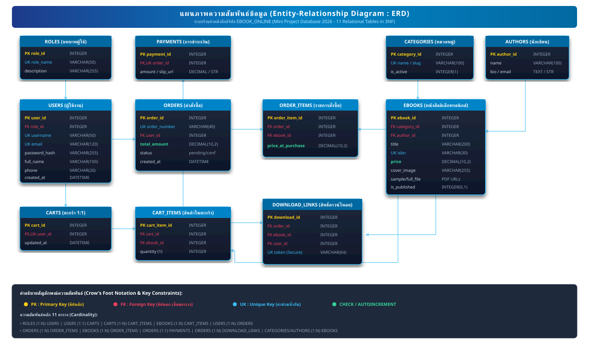
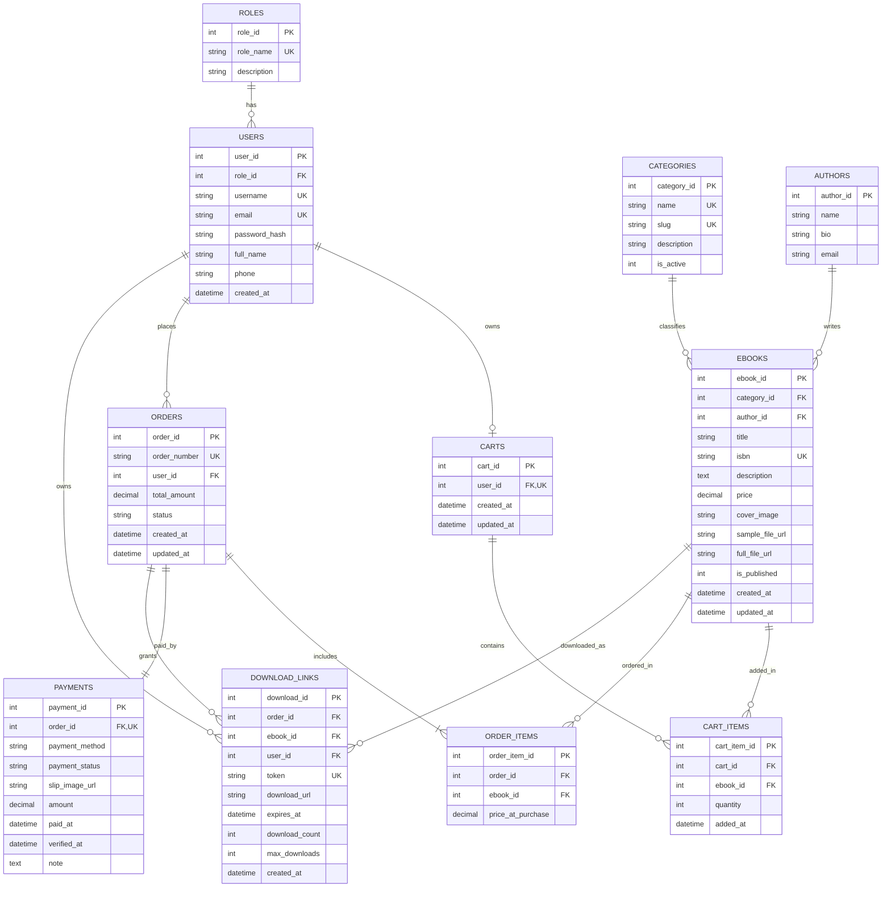

# เอกสารการออกแบบฐานข้อมูล (Database Design Document)
## โครงงาน: EBOOK_ONLINE (Mini Project Database ร้านขาย E-Book)

---

## 1. แผนภาพแสดงความสัมพันธ์ข้อมูล (Entity-Relationship Diagram: ERD)

*ภาพที่ 1 แผนภาพความสัมพันธ์ข้อมูลเชิงสัมพันธ์ (Entity-Relationship Diagram : ERD) ครอบคลุม 11 ตาราง*

### โครงสร้างความสัมพันธ์เชิงตรรกะ (Crow's Foot Notation & Attributes)

---

## 2. พจนานุกรมข้อมูล (Data Dictionary) ทั้ง 11 ตาราง

### 2.1 ตาราง `roles` (บทบาทผู้ใช้งาน)
| ชื่อฟิลด์ (Field) | ชนิดข้อมูล (Type) | คีย์ (Key) | Nullable | ค่าเริ่มต้น / ข้อจำกัด (Constraints) | ความหมายและคำอธิบาย |
| :--- | :--- | :---: | :---: | :--- | :--- |
| `role_id` | INTEGER | PK | NO | AUTOINCREMENT | รหัสระบุบทบาท |
| `role_name` | VARCHAR(50) | UK | NO | UNIQUE | ชื่อบทบาท เช่น `customer`, `admin` |
| `description` | VARCHAR(255) | - | YES | NULL | คำอธิบายสิทธิ์การใช้งาน |

---

### 2.2 ตาราง `users` (ผู้ใช้งานระบบ)
| ชื่อฟิลด์ (Field) | ชนิดข้อมูล (Type) | คีย์ (Key) | Nullable | ค่าเริ่มต้น / ข้อจำกัด (Constraints) | ความหมายและคำอธิบาย |
| :--- | :--- | :---: | :---: | :--- | :--- |
| `user_id` | INTEGER | PK | NO | AUTOINCREMENT | รหัสประจำตัวผู้ใช้งาน |
| `role_id` | INTEGER | FK | NO | DEFAULT 1, REFERENCES `roles(role_id)` | รหัสบทบาท (1=ลูกค้า, 2=ผู้ดูแลระบบ) |
| `username` | VARCHAR(50) | UK | NO | UNIQUE | ชื่อบัญชีผู้ใช้สำหรับเข้าสู่ระบบ |
| `email` | VARCHAR(120) | UK | NO | UNIQUE | อีเมลประจำตัว |
| `password_hash` | VARCHAR(255) | - | NO | - | รหัสผ่านที่ผ่านการแฮชเพื่อความปลอดภัย |
| `full_name` | VARCHAR(100) | - | NO | - | ชื่อ-นามสกุลจริง |
| `phone` | VARCHAR(20) | - | YES | NULL | เบอร์โทรศัพท์ติดต่อ |
| `created_at` | DATETIME | - | NO | CURRENT_TIMESTAMP | วันและเวลาที่ลงทะเบียน |

---

### 2.3 ตาราง `categories` (หมวดหมู่หนังสือ)
| ชื่อฟิลด์ (Field) | ชนิดข้อมูล (Type) | คีย์ (Key) | Nullable | ค่าเริ่มต้น / ข้อจำกัด (Constraints) | ความหมายและคำอธิบาย |
| :--- | :--- | :---: | :---: | :--- | :--- |
| `category_id` | INTEGER | PK | NO | AUTOINCREMENT | รหัสหมวดหมู่ |
| `name` | VARCHAR(100) | UK | NO | UNIQUE | ชื่อหมวดหมู่หนังสือ เช่น คอมพิวเตอร์, ธุรกิจ, นิยาย |
| `slug` | VARCHAR(100) | UK | NO | UNIQUE | คำระบุหมวดหมู่สำหรับ URL |
| `description` | TEXT | - | YES | NULL | คำอธิบายหมวดหมู่ |
| `is_active` | INTEGER | - | NO | DEFAULT 1, CHECK (`is_active` IN (0,1)) | สถานะเปิดใช้งานหมวดหมู่ (1=เปิด, 0=ปิด) |

---

### 2.4 ตาราง `authors` (ข้อมูลนักเขียน/ผู้แต่ง)
| ชื่อฟิลด์ (Field) | ชนิดข้อมูล (Type) | คีย์ (Key) | Nullable | ค่าเริ่มต้น / ข้อจำกัด (Constraints) | ความหมายและคำอธิบาย |
| :--- | :--- | :---: | :---: | :--- | :--- |
| `author_id` | INTEGER | PK | NO | AUTOINCREMENT | รหัสประจำตัวนักเขียน |
| `name` | VARCHAR(100) | - | NO | NOT NULL | ชื่อหรือนามปากกาของนักเขียน |
| `bio` | TEXT | - | YES | NULL | ประวัติหรือผลงานโดยย่อ |
| `email` | VARCHAR(120) | - | YES | NULL | อีเมลติดต่อนักเขียน |

---

### 2.5 ตาราง `ebooks` (หนังสืออิเล็กทรอนิกส์)
| ชื่อฟิลด์ (Field) | ชนิดข้อมูล (Type) | คีย์ (Key) | Nullable | ค่าเริ่มต้น / ข้อจำกัด (Constraints) | ความหมายและคำอธิบาย |
| :--- | :--- | :---: | :---: | :--- | :--- |
| `ebook_id` | INTEGER | PK | NO | AUTOINCREMENT | รหัสประจำตัว E-Book |
| `category_id` | INTEGER | FK | NO | REFERENCES `categories(category_id)` | หมวดหมู่หนังสือ |
| `author_id` | INTEGER | FK | NO | REFERENCES `authors(author_id)` | รหัสนักเขียน |
| `title` | VARCHAR(200) | - | NO | NOT NULL | ชื่อเรื่องหนังสือ |
| `isbn` | VARCHAR(30) | UK | YES | UNIQUE | เลขมาตรฐานสากลประจำหนังสือ |
| `description` | TEXT | - | YES | NULL | รายละเอียดและเรื่องย่อ |
| `price` | DECIMAL(10,2) | - | NO | CHECK (`price` >= 0) | ราคาขาย (ต้องไม่ติดลบ) |
| `cover_image` | VARCHAR(255) | - | NO | DEFAULT '/images/default.jpg' | ที่อยู่ไฟล์ภาพปก |
| `sample_file_url`| VARCHAR(255) | - | YES | NULL | ลิงก์ตัวอย่างหนังสือทดลองอ่าน |
| `full_file_url` | VARCHAR(255) | - | NO | NOT NULL | ที่อยู่ไฟล์ฉบับเต็ม (เข้าถึงผ่านระบบปลอดภัย) |
| `is_published` | INTEGER | - | NO | DEFAULT 1, CHECK (`is_published` IN (0,1)) | สถานะพร้อมขาย (1=ขาย, 0=ปิดการขาย) |
| `created_at` | DATETIME | - | NO | CURRENT_TIMESTAMP | วันที่เพิ่มหนังสือ |
| `updated_at` | DATETIME | - | NO | CURRENT_TIMESTAMP | วันที่แก้ไขล่าสุด |

---

### 2.6 ตาราง `carts` (ตะกร้าสินค้าของผู้ใช้)
| ชื่อฟิลด์ (Field) | ชนิดข้อมูล (Type) | คีย์ (Key) | Nullable | ค่าเริ่มต้น / ข้อจำกัด (Constraints) | ความหมายและคำอธิบาย |
| :--- | :--- | :---: | :---: | :--- | :--- |
| `cart_id` | INTEGER | PK | NO | AUTOINCREMENT | รหัสตะกร้าสินค้า |
| `user_id` | INTEGER | FK,UK | NO | UNIQUE, REFERENCES `users(user_id)` ON DELETE CASCADE | ผู้ใช้เจ้าของตะกร้า (1 ผู้ใช้มีได้ 1 ตะกร้า) |
| `created_at` | DATETIME | - | NO | CURRENT_TIMESTAMP | วันที่สร้างตะกร้า |
| `updated_at` | DATETIME | - | NO | CURRENT_TIMESTAMP | วันที่มีการปรับปรุงล่าสุด |

---

### 2.7 ตาราง `cart_items` (รายการสินค้าในตะกร้า)
| ชื่อฟิลด์ (Field) | ชนิดข้อมูล (Type) | คีย์ (Key) | Nullable | ค่าเริ่มต้น / ข้อจำกัด (Constraints) | ความหมายและคำอธิบาย |
| :--- | :--- | :---: | :---: | :--- | :--- |
| `cart_item_id` | INTEGER | PK | NO | AUTOINCREMENT | รหัสรายการย่อยในตะกร้า |
| `cart_id` | INTEGER | FK | NO | REFERENCES `carts(cart_id)` ON DELETE CASCADE | รหัสตะกร้าที่สังกัด |
| `ebook_id` | INTEGER | FK | NO | REFERENCES `ebooks(ebook_id)` ON DELETE CASCADE | รหัสหนังสือที่เพิ่มลงตะกร้า |
| `quantity` | INTEGER | - | NO | DEFAULT 1, CHECK (`quantity` = 1) | จำนวนสินค้า (E-Book ซื้อได้เล่มละ 1 สิทธิ์) |
| `added_at` | DATETIME | - | NO | CURRENT_TIMESTAMP | วันและเวลาที่หยิบใส่ตะกร้า |
| - | - | UK | NO | UNIQUE(`cart_id`, `ebook_id`) | ป้องกันการเพิ่มหนังสือเล่มเดิมซ้ำในตะกร้า |

---

### 2.8 ตาราง `orders` (คำสั่งซื้อ)
| ชื่อฟิลด์ (Field) | ชนิดข้อมูล (Type) | คีย์ (Key) | Nullable | ค่าเริ่มต้น / ข้อจำกัด (Constraints) | ความหมายและคำอธิบาย |
| :--- | :--- | :---: | :---: | :--- | :--- |
| `order_id` | INTEGER | PK | NO | AUTOINCREMENT | รหัสประจำคำสั่งซื้อ |
| `order_number`| VARCHAR(40) | UK | NO | UNIQUE | เลขที่คำสั่งซื้อ เช่น `ORD-20260927-001` |
| `user_id` | INTEGER | FK | NO | REFERENCES `users(user_id)` | ผู้สั่งซื้อ |
| `total_amount` | DECIMAL(10,2) | - | NO | CHECK (`total_amount` >= 0) | ยอดรวมเงินสุทธิ |
| `status` | VARCHAR(20) | - | NO | DEFAULT 'pending', CHECK (`status` IN ('pending', 'confirmed', 'cancelled')) | สถานะคำสั่งซื้อ (`pending`=รอชำระ/รอตรวจ, `confirmed`=ยืนยันแล้ว, `cancelled`=ยกเลิก) |
| `created_at` | DATETIME | - | NO | CURRENT_TIMESTAMP | วันที่สร้างคำสั่งซื้อ |
| `updated_at` | DATETIME | - | NO | CURRENT_TIMESTAMP | วันที่อัปเดตสถานะ |

---

### 2.9 ตาราง `order_items` (รายการหนังสือในแต่ละคำสั่งซื้อ)
| ชื่อฟิลด์ (Field) | ชนิดข้อมูล (Type) | คีย์ (Key) | Nullable | ค่าเริ่มต้น / ข้อจำกัด (Constraints) | ความหมายและคำอธิบาย |
| :--- | :--- | :---: | :---: | :--- | :--- |
| `order_item_id` | INTEGER | PK | NO | AUTOINCREMENT | รหัสรายการในคำสั่งซื้อ |
| `order_id` | INTEGER | FK | NO | REFERENCES `orders(order_id)` ON DELETE CASCADE | รหัสคำสั่งซื้อที่สังกัด |
| `ebook_id` | INTEGER | FK | NO | REFERENCES `ebooks(ebook_id)` | รหัสหนังสือที่ซื้อ |
| `price_at_purchase` | DECIMAL(10,2) | - | NO | CHECK (`price_at_purchase` >= 0) | ราคาประวัติ ณ วันที่สั่งซื้อ (เพื่อความถูกต้องทางบัญชี) |
| - | - | UK | NO | UNIQUE(`order_id`, `ebook_id`) | ไม่บันทึกหนังสือซ้ำในคำสั่งซื้อเดียวกัน |

---

### 2.10 ตาราง `payments` (การชำระเงินจำลอง)
| ชื่อฟิลด์ (Field) | ชนิดข้อมูล (Type) | คีย์ (Key) | Nullable | ค่าเริ่มต้น / ข้อจำกัด (Constraints) | ความหมายและคำอธิบาย |
| :--- | :--- | :---: | :---: | :--- | :--- |
| `payment_id` | INTEGER | PK | NO | AUTOINCREMENT | รหัสการชำระเงิน |
| `order_id` | INTEGER | FK,UK | NO | UNIQUE, REFERENCES `orders(order_id)` ON DELETE CASCADE | รหัสคำสั่งซื้อที่ผูกกับการชำระเงินนี้ |
| `payment_method` | VARCHAR(30) | - | NO | CHECK (`payment_method` IN ('promptpay_qr', 'bank_transfer', 'mock_gateway')) | ช่องทางจำลอง (QR พร้อมเพย์, โอนเงิน) |
| `payment_status` | VARCHAR(20) | - | NO | DEFAULT 'submitted', CHECK (`payment_status` IN ('pending', 'submitted', 'verified', 'rejected')) | สถานะการชำระเงิน |
| `slip_image_url` | VARCHAR(255) | - | YES | NULL | ที่อยู่ไฟล์ภาพสลิปจำลองที่ลูกค้าอัปโหลด |
| `amount` | DECIMAL(10,2) | - | NO | CHECK (`amount` >= 0) | จำนวนเงินที่ชำระตามหลักฐาน |
| `paid_at` | DATETIME | - | NO | CURRENT_TIMESTAMP | วันและเวลาที่แจ้งชำระเงิน |
| `verified_at` | DATETIME | - | YES | NULL | วันและเวลาที่แอดมินตรวจสอบเสร็จสิ้น |
| `note` | VARCHAR(255) | - | YES | NULL | หมายเหตุเพิ่มเติม |

---

### 2.11 ตาราง `download_links` (สิทธิ์และลิงก์ดาวน์โหลดที่ปลอดภัย)
| ชื่อฟิลด์ (Field) | ชนิดข้อมูล (Type) | คีย์ (Key) | Nullable | ค่าเริ่มต้น / ข้อจำกัด (Constraints) | ความหมายและคำอธิบาย |
| :--- | :--- | :---: | :---: | :--- | :--- |
| `download_id` | INTEGER | PK | NO | AUTOINCREMENT | รหัสสิทธิ์ดาวน์โหลด |
| `order_id` | INTEGER | FK | NO | REFERENCES `orders(order_id)` ON DELETE CASCADE | รหัสคำสั่งซื้อที่อนุมัติ |
| `ebook_id` | INTEGER | FK | NO | REFERENCES `ebooks(ebook_id)` | รหัสหนังสือที่ได้รับสิทธิ์ |
| `user_id` | INTEGER | FK | NO | REFERENCES `users(user_id)` | ลูกค้าที่ถือสิทธิ์ดาวน์โหลด |
| `token` | VARCHAR(64) | UK | NO | UNIQUE | โทเคนสุ่มเพื่อความปลอดภัย ไม่เปิดเผย Direct Path |
| `download_url` | VARCHAR(255) | - | NO | NOT NULL | Endpoint ดาวน์โหลดเฉพาะกิจ เช่น `/api/download/:token` |
| `expires_at` | DATETIME | - | NO | NOT NULL | วันหมดอายุสิทธิ์ดาวน์โหลด |
| `download_count` | INTEGER | - | NO | DEFAULT 0, CHECK (`download_count` >= 0) | จำนวนครั้งที่ดาวน์โหลดไปแล้ว |
| `max_downloads` | INTEGER | - | NO | DEFAULT 10, CHECK (`max_downloads` >= 1) | จำนวนครั้งสูงสุดที่อนุญาตให้ดาวน์โหลด |
| `created_at` | DATETIME | - | NO | CURRENT_TIMESTAMP | วันที่สร้างสิทธิ์ดาวน์โหลด |
| - | - | UK | NO | UNIQUE(`order_id`, `ebook_id`) | 1 สิทธิ์ต่อ 1 เล่มในแต่ละคำสั่งซื้อ |

---

## 3. การปรับแบบข้อมูลให้อยู่ในรูปแบบบรรทัดฐาน (Database Normalization - 3NF)

การออกแบบฐานข้อมูลทั้ง 11 ตารางนี้ ผ่านการตรวจสอบกระบวนการ Normalization ดังนี้:

### 3.1 รูปแบบบรรทัดฐานขั้นที่ 1 (First Normal Form: 1NF)
* ทุก Attribute เก็บค่าที่เป็น **Atomic Value** (ค่าเดี่ยว ไม่มีการเก็บรายการหลายค่า เช่น คั่นด้วยจุลภาค)
* มีการกำหนด Primary Key ที่ระบุ Tuple ได้อย่างเฉพาะเจาะจงในทุกตาราง
* รายการสินค้าที่ซื้อไม่ได้ถูกเก็บรวมไว้ในตาราง `orders` แบบชุดข้อมูลซ้ำ แต่ถูกแยกออกไปเป็นตารางลูก `order_items`

### 3.2 รูปแบบบรรทัดฐานขั้นที่ 2 (Second Normal Form: 2NF)
* อยู่ในระดับ 1NF แล้ว
* ขจัด **Partial Dependency** (การที่ Attribute ไม่ได้ขึ้นตรงต่อ Primary Key ทั้งหมดในกรณี Composite Key)
  * เช่น ในตาราง `order_items` และ `cart_items` มีการใช้ Surrogate PK (`order_item_id`, `cart_item_id`) และข้อมูลทั้งหมดขึ้นตรงกับคีย์หลักนี้อย่างสมบูรณ์ ข้อมูลราคาในขณะซื้อ `price_at_purchase` ขึ้นตรงกับรายการสั่งซื้อนั้นๆ

### 3.3 รูปแบบบรรทัดฐานขั้นที่ 3 (Third Normal Form: 3NF)
* อยู่ในระดับ 2NF แล้ว
* ขจัด **Transitive Dependency** (การที่ฟิลด์ที่ไม่ใช่คีย์ ไปขึ้นต่อฟิลด์อื่นที่ไม่ใช่คีย์หลัก)
  * ข้อมูลผู้แต่ง (ชื่อ, ประวัติ, อีเมล) ไม่เก็บปนไว้ในตาราง `ebooks` แต่แยกออกมาเป็นตาราง `authors` และอ้างอิงผ่าน `author_id` เท่านั้น เพื่อไม่ให้เกิดข้อมูลซ้ำซ้อนเมื่อผู้แต่งคนเดิมมีหนังสือหลายเล่ม
  * ข้อมูลหมวดหมู่ถูกแยกเป็นตาราง `categories` และอ้างอิงผ่าน `category_id`
  * บทบาทผู้ใช้ถูกแยกเป็นตาราง `roles` และอ้างอิงผ่าน `role_id`
  * ข้อมูลการชำระเงินถูกแยกเป็นตาราง `payments` มีวงจรชีวิตและการตรวจสอบต่างหาก

> **เหตุผลในการเก็บข้อมูลบางส่วนเพื่อความถูกต้องทางธุรกิจ (Business Compliance):**  
> ในตาราง `order_items` มีการเก็บฟิลด์ `price_at_purchase` (ราคา ณ วันที่สั่งซื้อ) ซ้ำกับฟิลด์ `price` ในตาราง `ebooks` โดยมีเหตุผลที่จำเป็นอย่างยิ่งทางบัญชีและกฎหมายธุรกรรมดิจิทัล เพื่อป้องกันไม่ให้ยอดประวัติการสั่งซื้อในอดีตเปลี่ยนแปลง เมื่อร้านค้าปรับราคาหนังสือในอนาคต

---

## 4. เงื่อนไขทางธุรกิจและความปลอดภัย (Security & Business Logic)

1. **การควบคุมสิทธิ์ดาวน์โหลด (Secure Download Gateway):**
   * ระบบไม่อนุญาตให้เปิดเผย URL โดยตรงของไฟล์ E-Book สู่สาธารณะ
   * ลิงก์ดาวน์โหลดในตาราง `download_links` จะถูกสร้างขึ้นและใช้งานได้ **ก็ต่อเมื่อ** คำสั่งซื้อในตาราง `orders` มีสถานะเป็น `'confirmed'` และการชำระเงินใน `payments` มีสถานะเป็น `'verified'`
   * หากคำสั่งซื้อยังอยู่ในสถานะ `'pending'` หรือ `'cancelled'` ระบบจะปฏิเสธการเข้าถึงและไม่แสดงปุ่มดาวน์โหลด (HTTP 403 Forbidden)
2. **การจำลองการชำระเงิน (Mock Payment):**
   * ใช้ช่องทางจำลอง เช่น QR Code พร้อมเพย์จำลอง หรือแบบฟอร์มแนบไฟล์รูปสลิปจำลอง โดยไม่มีการเรียกเก็บเงินจริงหรือบันทึกข้อมูลบัตรเครดิตจริง
3. **การป้องกันข้อมูลผิดพลาด (Data Integrity Constraints):**
   * กำหนดราคา `CHECK (price >= 0)`
   * ป้องกันการซ้ำซ้อนของบัญชี `UNIQUE (username)`, `UNIQUE (email)`
   * ป้องกันการซื้อหนังสือซ้ำในตะกร้า `UNIQUE (cart_id, ebook_id)`
