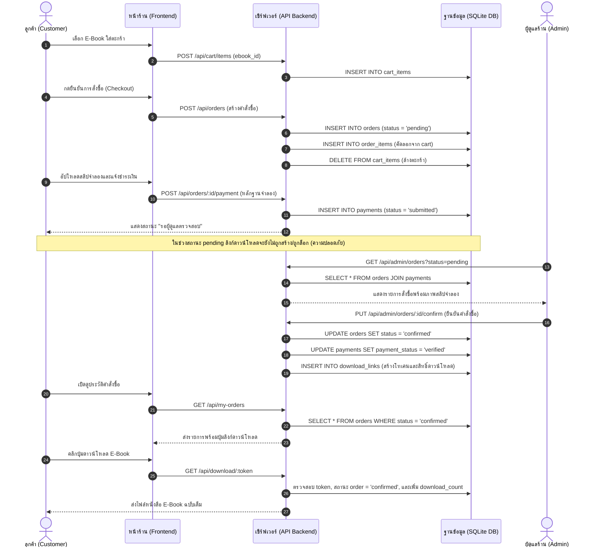
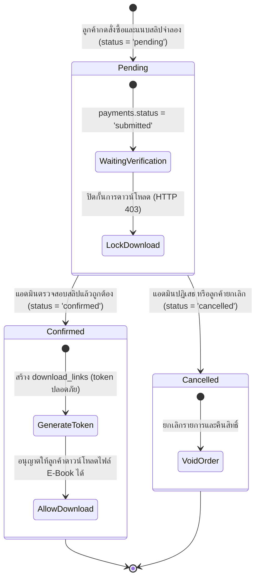

# แผนภาพเส้นทางการทำงานและสถานการณ์โจทย์ (System Flow & Scenarios)
## โครงงาน: EBOOK_ONLINE (Mini Project Database ร้านขาย E-Book)

เอกสารนี้วิเคราะห์และแปลงโจทย์จาก **ข้อ 1. สถานการณ์โจทย์** ของใบงาน ให้เป็นกระบวนการทำงานจริงของระบบ (Business Logic & System Flow)

---

## 1. การวิเคราะห์ตัวละครและบทบาท (Actors & Roles)

ตามสถานการณ์โจทย์ มี 2 ตัวละครหลักที่มีปฏิสัมพันธ์กับฐานข้อมูล:

```
[ ลูกค้า (Customer) ]                                  [ ผู้ดูแลร้าน (Admin) ]
       │                                                         │
       ├─ สมัครสมาชิก / ล็อกอิน                                   ├─ ล็อกอินระบบหลังบ้าน
       ├─ ค้นหา / คัดกรอง E-Book                                 ├─ จัดการหนังสือ / หมวดหมู่
       ├─ เลือกใส่ตะกร้า / ปรับจำนวน                             ├─ ตรวจสอบหลักฐานการชำระเงินจำลอง
       ├─ สั่งซื้อ (Checkout)                                    ├─ ยืนยันคำสั่งซื้อ (อนุมัติ / ปฏิเสธ)
       ├─ แนบสลิปชำระเงินจำลอง                                    └─ ดู Dashboard วิเคราะห์ยอดขายและแนวโน้ม
       └─ รับลิงก์ดาวน์โหลด (เฉพาะเล่มที่ยืนยันแล้ว)
```

---

## 2. แผนภาพเส้นทางการสั่งซื้อจนถึงดาวน์โหลด (Customer to Admin Flow)



---

## 3. วงจรสถานะคำสั่งซื้อและเงื่อนไขความปลอดภัย (Order Lifecycle & Access Gate)

สถานะของคำสั่งซื้อในตาราง `orders` และ `payments` จะเป็นตัวควบคุมสิทธิ์การเข้าถึงข้อมูลตามเงื่อนไขโจทย์:



### กฎข้อห้ามเด็ดขาด (Security Rule)
> **ระบบต้องไม่เปิดเผย Direct URL ของไฟล์ E-Book** และ **ต้องไม่เปิดลิงก์ของหนังสือที่ลูกค้ายังไม่ได้ซื้อ หรือคำสั่งซื้อยังไม่ยืนยัน** โดยทุกครั้งที่เรียกโหลดไฟล์ ต้องผ่านตัวกรอง:
> `WHERE orders.status = 'confirmed' AND payments.payment_status = 'verified'`

---

## 4. ระบบวิเคราะห์แนวโน้มสำหรับผู้ดูแลร้าน (Admin Analytics & Insights)
ตามโจทย์ *"ผู้ดูแลต้องติดตามการขายและวิเคราะห์แนวโน้มจากข้อมูลในฐานข้อมูลได้"* ระบบจัดเตรียมหน้า Dashboard เชื่อมโยงกับ 4 คำถามทางธุรกิจ:

1. **แนวโน้มรายได้และจำนวนออเดอร์:** กราฟยอดขายเปรียบเทียบตามวันและเดือน ดูอัตราการเติบโต
2. **สินค้าขายดีติดอันดับ:** Top 5 หรือ Top 10 เล่มที่ทำยอดขายสูงสุด เพื่อใช้วางแผนโปรโมชัน
3. **หมวดหมู่ทำเงินสูงสุด:** สัดส่วนยอดขายแบ่งตามหมวดหมู่ (กราฟวงกลม/แท่ง)
4. **พฤติกรรมลูกค้า:** ลูกค้าที่มียอดซื้อสะสมสูงสุด (Top Spenders) และสัดส่วนสถานะออเดอร์ (สำเร็จ vs รอตรวจ vs ยกเลิก)

<div align="center">

<br><em>ภาพประกอบที่ 1: หน้าต่างแคตตาล็อกหนังสือและการค้นหา E-Book หน้าร้าน (Storefront Catalog)</em>
</div>

<div align="center">

<br><em>ภาพประกอบที่ 2: หน้าต่างตะกร้าสินค้าและการคำนวณราคาสุทธิแบบ Real-Time (Shopping Cart Drawer)</em>
</div>

<div align="center">

<br><em>ภาพประกอบที่ 3: หน้าต่างประวัติคำสั่งซื้อ การควบคุมสิทธิ์ และปุ่มดาวน์โหลด E-Book ปลอดภัย</em>
</div>

<div align="center">

<br><em>ภาพประกอบที่ 4: แผงควบคุมหลักผู้ดูแลระบบ (Admin Dashboard) และสรุปยอดขายสดจากฐานข้อมูล</em>
</div>
