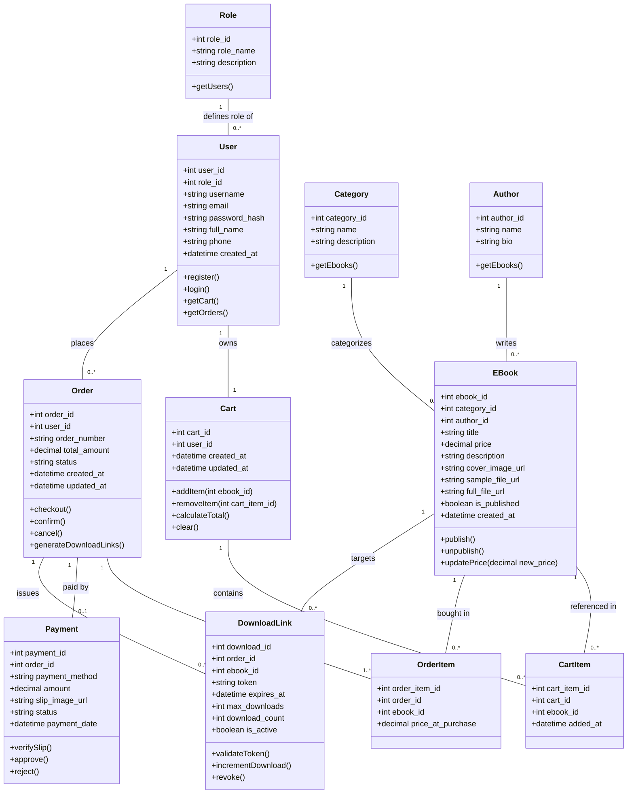
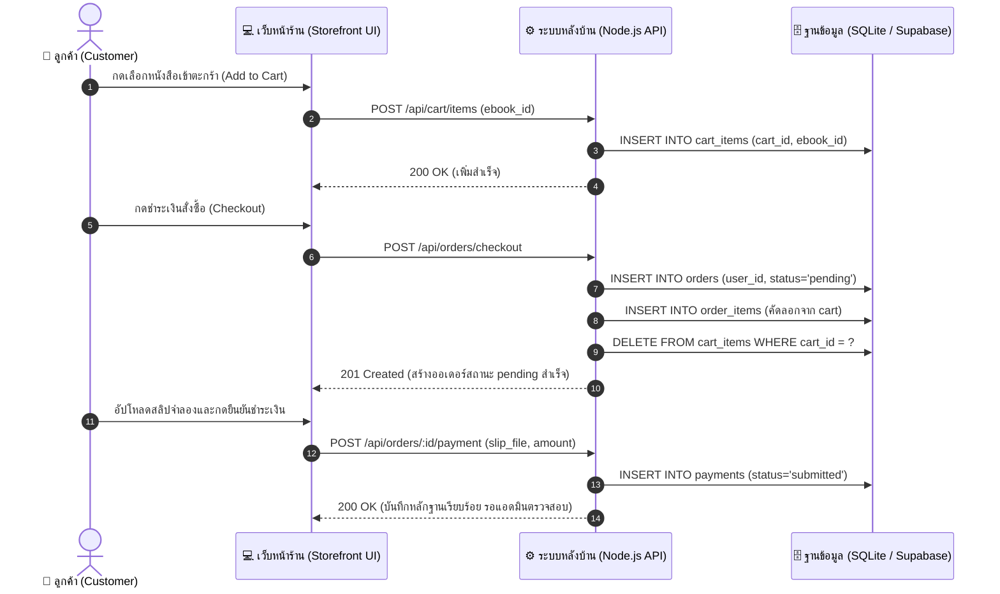
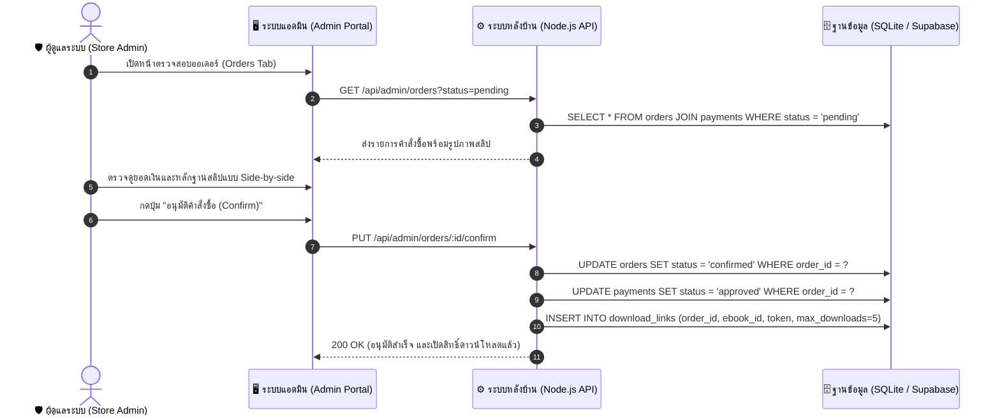
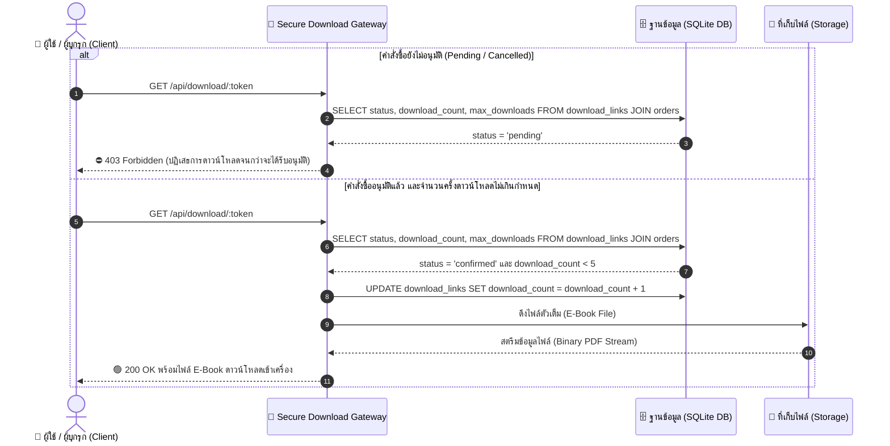
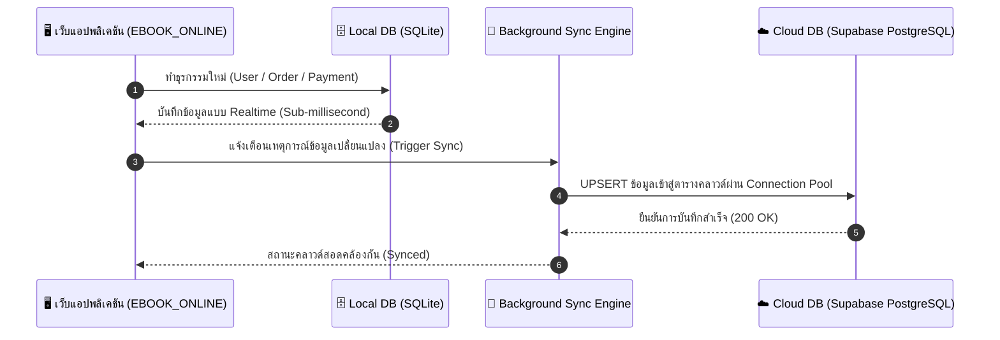

# แผนภาพคลาสและลำดับการทำงาน (Class & Sequence Diagrams)
## โครงงาน: EBOOK_ONLINE (ร้านขายหนังสือและอีบุ๊กออนไลน์)
### รายวิชาระบบฐานข้อมูล [31-407-102-301] ประจำปีการศึกษา 2569

---

## 1. ผังคลาสของระบบ (System Class Diagram)

แผนภาพคลาสแสดงความสัมพันธ์ระหว่างโมเดลและเอนทิตีข้อมูลทั้ง 11 คลาสในระบบ ตามโครงสร้างมาตรฐานการออกแบบเชิงวัตถุและระบบฐานข้อมูลเชิงสัมพันธ์:

---

## 2. แผนภาพลำดับการทำงาน (Sequence Diagrams)

### 2.1 แผนภาพลำดับ: การสั่งซื้อสินค้าและแนบสลิปชำระเงินจำลอง (Order & Payment Submission Flow)

---

### 2.2 แผนภาพลำดับ: การตรวจสอบสลิปและอนุมัติออเดอร์โดยผู้ดูแลระบบ (Admin Verification Flow)

---

### 2.3 แผนภาพลำดับ: กลไกสกัดกั้นความปลอดภัยในการดาวน์โหลด (Security Download Gate: 403 vs 200)

---

### 2.4 แผนภาพลำดับ: การเชื่อมโยงและซิงค์ข้อมูลบนคลาวด์ (Cloud Real-time Synchronization Flow)

